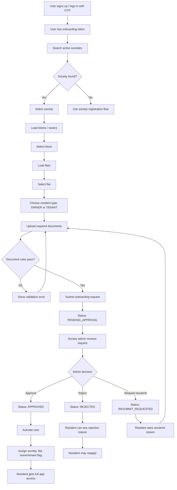
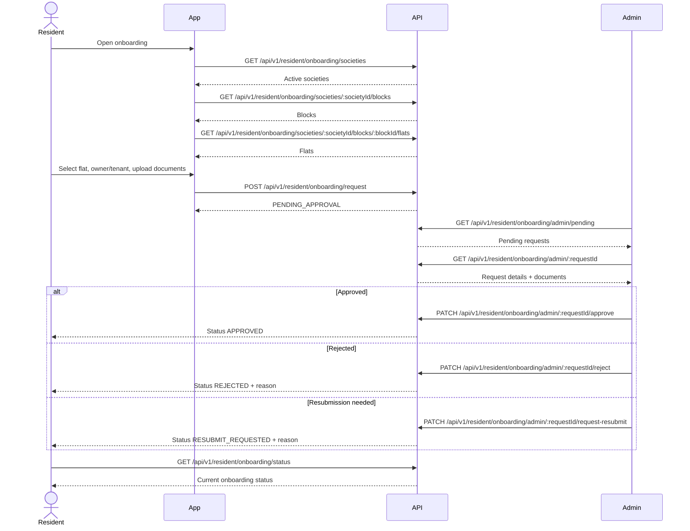
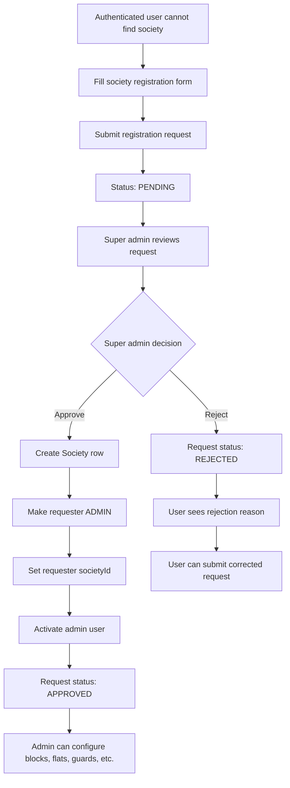
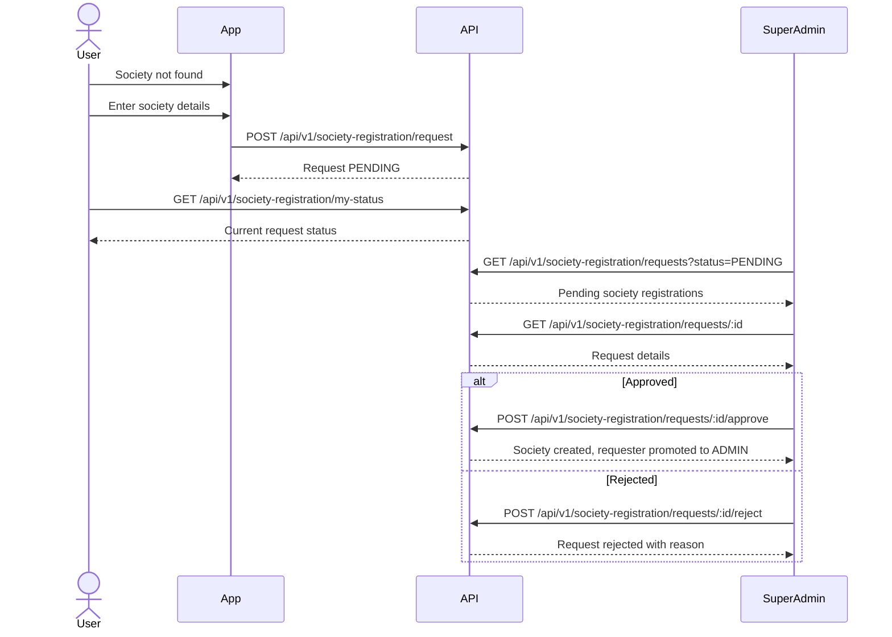

# Society Onboarding Flow

This document has two flows:

1. Resident joins an existing society.
2. User registers a new society for super-admin approval.

## 1. Resident Onboarding Into Existing Society



## Resident Onboarding API Sequence



## 2. New Society Registration Flow

Use this when the resident cannot find their society in the onboarding list.



## New Society Registration API Sequence



## Mind Map Outline

```text
Society Onboarding
├── Resident joins existing society
│   ├── OTP signup/login
│   ├── Search society
│   ├── Select block/tower
│   ├── Select flat
│   ├── Choose OWNER or TENANT
│   ├── Upload documents
│   │   ├── OWNER: ownership proof required
│   │   ├── TENANT: tenant agreement required
│   │   └── Both: at least one ID proof required
│   ├── Submit request
│   ├── Admin review
│   │   ├── Approve
│   │   ├── Reject
│   │   └── Request resubmission
│   └── Final access
│       ├── Approved: active resident
│       ├── Rejected: can reapply
│       └── Resubmit: upload corrected docs
└── New society registration
    ├── Society not found
    ├── Submit society details
    ├── Super admin review
    │   ├── Approve
    │   └── Reject
    └── Approval result
        ├── Society created
        ├── Requester becomes ADMIN
        └── Admin configures society data
```

## Status Values

Resident onboarding:

- `NOT_STARTED`
- `DRAFT`
- `PENDING_DOCS`
- `PENDING_APPROVAL`
- `RESUBMIT_REQUESTED`
- `APPROVED`
- `REJECTED`

Society registration:

- `NOT_SUBMITTED`
- `PENDING`
- `APPROVED`
- `REJECTED`

